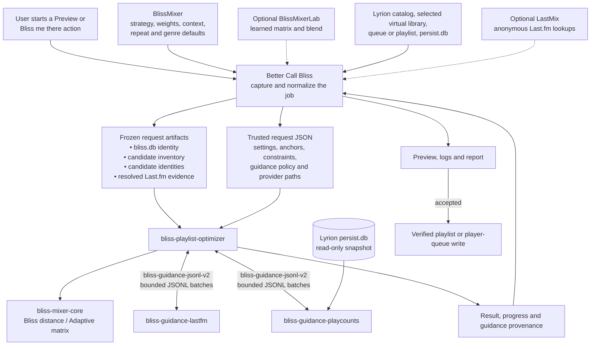
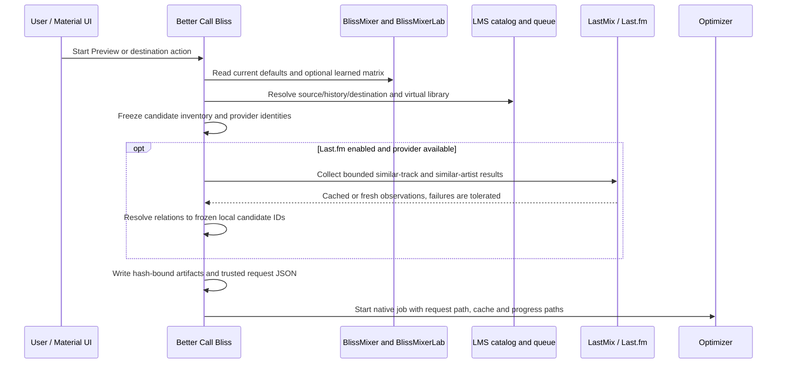
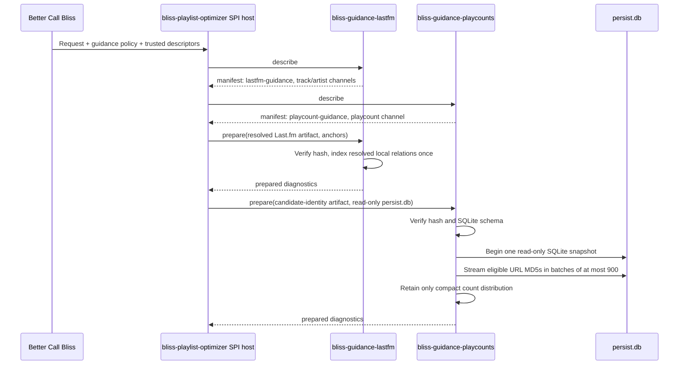
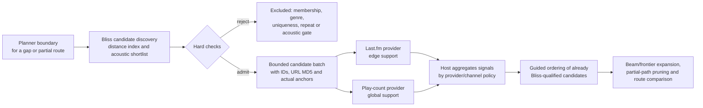
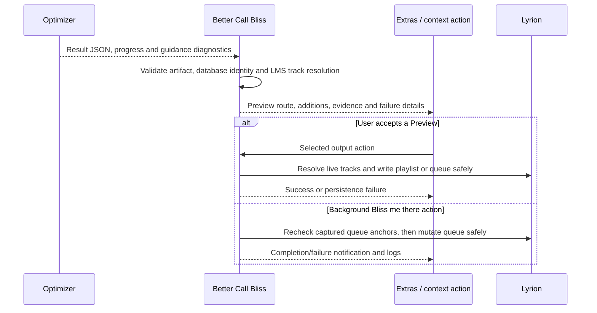

# Guidance data flow

This document describes the shipped, end-to-end information flow for a Better
Call Bliss optimization job that uses the optional Guidance SPI v2 providers.
It is product documentation, not a migration plan. The related
[`bliss-playlist-guidance-spi`](https://github.com/chrober/bliss-playlist-guidance-spi)
contract is host-neutral: Better Call Bliss currently uses it through
[`bliss-playlist-optimizer`](https://github.com/chrober/bliss-playlist-optimizer),
and a future `bliss-mixer` integration may use the same providers while ranking
its own Bliss-derived candidate pool.

The central boundary is intentionally simple: **Bliss decides which tracks and
routes are acoustically valid; guidance can only express a bounded preference
among those already valid choices.** Guidance cannot add remote music, bypass
the selected virtual library or genre policy, relax repeat windows, or turn an
acoustically rejected transition into an accepted one.

## At a glance

Only Better Call Bliss talks to LMS, LastMix, the browser UI, and playlist or
queue persistence. Only the play-count provider opens `persist.db`; the
optimizer itself is network-free and has no Lyrion-specific SQLite queries.

## Who consumes each setting, and when?

The user-facing settings are read once by Better Call Bliss while it creates a
job. The resulting request is immutable for the optimizer process lifetime.

| Setting family | Owner and source | First consumer | How it affects the job |
| --- | --- | --- | --- |
| Strategy, Static weights, Adaptive context, repeat windows and genre policy | BlissMixer current settings, with Better Call Bliss job overrides | Better Call Bliss, then optimizer | Shapes the acoustic matrix, hard repeat checks, and the frozen eligible candidate library. |
| Learned matrix and blend | Optional BlissMixerLab | Better Call Bliss, then optimizer | Supplies an optional matrix artifact and learned blend for Adaptive scoring. Its absence uses the documented Bliss fallback. |
| Last.fm enabled; similar-track and similar-artist percentages | Better Call Bliss job settings | Better Call Bliss, then optimizer guidance policy | Enables LastMix acquisition and produces two independent policy weights: `lastfm_track` and `lastfm_artist`. The Last.fm provider itself receives no UI setting. |
| Play-count influence, from -100 to 100 | Better Call Bliss job setting, initialized from BlissMixer | Better Call Bliss, then optimizer guidance policy | Becomes a signed `playcount` policy weight. Negative prefers lower counts; positive prefers higher counts; zero means the provider is not started. |
| Candidate library | Active Lyrion virtual library, source exclusions, LMS membership, and captured genre policy | Better Call Bliss, then optimizer | Determines which *generated* tracks are eligible. It is frozen before native search starts. |

The provider executables do not read preferences or web-form values. Better Call
Bliss converts those values to `guidance_policy` entries in the trusted native
request. The optimizer applies the policy only when it aggregates provider
signals. This keeps user-interface semantics out of reusable Rust providers.

## Phase 1: Better Call Bliss captures a reproducible job

Before it launches Rust, Better Call Bliss resolves the playlist, queue, or
selected destination into stable local track identities. It snapshots the
applicable history, source anchors, destination/rejoin anchors, output choice,
and effective settings. It also constructs two distinct local-library artifacts:

- `lms-local-candidate-inventory-v1` is the optimizer's allowlist of generated
  candidates. It is the intersection of usable `bliss.db` rows, current local
  LMS tracks, selected virtual-library membership, source exclusions, and the
  captured genre policy.
- `eligible-candidate-identities-v1` is a compact provider-facing identity list.
  It contains the optimizer candidate ID and Lyrion URL MD5 needed by the
  play-count provider. It does not contain decoded Bliss feature vectors.

The optimizer validates these hash- and database-bound artifacts. It can use a
private decoded-library cache, but a changed `bliss.db` or LMS library scan is a
safe cache miss and the plugin revalidates live LMS objects before persistence.

### Last.fm acquisition happens before the optimizer starts

Better Call Bliss owns LastMix integration because it already has the Lyrion
context, user settings, cache behavior, and failure handling. For the distinct
source tracks and artists relevant to the job, it asks LastMix for bounded
similar-track and similar-artist observations. It then resolves returned artist,
title, and available MBID data against the frozen local candidate inventory.

Only successful local matches are written to the hash-bound
`resolved-lastfm-evidence-v1` artifact. A remote, unresolved, stale, or
non-LMS track is not a native candidate. Missing network access, rate limiting,
or provider failure leaves the artifact partial or absent and the job continues
with Bliss alone.

## Phase 2: the optimizer starts providers through the host-neutral SPI

The request declares trusted executable paths, timeouts, immutable artifact
descriptors, read-only resources, and the policy weights. The optimizer starts
only configured providers. It first checks each provider's `describe` manifest
for SPI version `2`, the host-neutral protocol name
`bliss-guidance-jsonl-v2`, its expected provider ID, and supported channels.

Provider failure is advisory. A bad manifest, timeout, malformed JSONL response,
artifact hash mismatch, unavailable Last.fm data, or SQLite problem disables
only the affected provider for that job. The optimizer records the diagnostic
and continues with Bliss-only search.

### What each provider collects and retains

| Provider | Data acquisition | `prepare` work | `score` work |
| --- | --- | --- | --- |
| `bliss-guidance-lastfm` | Better Call Bliss collects through LastMix before Rust launches. The provider makes no network request. | Verifies and indexes the resolved Last.fm artifact by source/anchor, local candidate, and channel. | Reads the actual edge anchors and bounded candidate batch; emits positive edge-scoped `lastfm_track` and/or `lastfm_artist` signals where evidence exists. |
| `bliss-guidance-playcounts` | The provider itself opens the trusted `persist.db` path. Better Call Bliss does not build a play-count JSON file. | Opens one read-only SQLite snapshot; streams the frozen eligible identity population to build a compact count distribution. | Looks up only uncached URL MD5s from the bounded candidate batch in the same snapshot, then emits normalized `playcount` signals. |

The play-count distribution is calculated from the complete frozen eligible
candidate population so that a candidate's percentile is comparable across
different planner batches. The provider does **not** retain a whole-library
`urlmd5 -> playcount` map; it keeps only the distribution plus a bounded cache
of values actually requested during scoring.

## Phase 3: Bliss-first candidate search, then bounded guidance

For every route, bridge, extension, or destination boundary, the optimizer
applies its hard rules first. It loads and scores usable Bliss rows, removes
tracks outside the frozen candidate library, enforces genre and repeat windows,
and creates a bounded acoustic shortlist. Guidance never runs over all 64k or
200k library tracks merely to gather diagnostics.

The actual SPI `score` request contains only the candidates under consideration
at that planner boundary and its real context: a global or edge scope, left and
right anchors where applicable, and a small ordered context suffix. Providers
may return signals only for IDs in that request. Omitted IDs are neutral.

The optimizer aggregates only declared channels:

- `lastfm_track` and `lastfm_artist` are independent positive supporting
  signals. Their per-job percentages become separate policy weights.
- `playcount` is a normalized unary signal. The signed per-job policy weight
  determines whether the same count favors less- or more-played tracks.

After aggregation, the adjustment participates in the existing planner's
candidate ordering, path expansion, beam/frontier pruning, and completed-route
comparison. It is a tie-breaking or near-tie preference inside the acoustic
shortlist—not a second candidate generator and not a post-hoc Perl reranker.
Stable identity ordering and the job generation seed preserve reproducibility.

## Phase 4: results return to Better Call Bliss

The optimizer writes one final JSON result to stdout, a structured failure to
stderr, and best-effort progress to the job-local sidecar. Its result contains
the selected route, acoustic quality information, provider preparation and
score diagnostics, an aggregate guidance-signal count, and stable opaque
candidate identities. It does not return the providers' raw evidence artifacts.
The provider sessions are then closed; the play-count provider releases its
SQLite snapshot and cache.

The final LMS write remains outside all Rust binaries. Better Call Bliss
rechecks the current database identity and resolves opaque candidate IDs to live
LMS objects before it creates or overwrites a playlist or changes a player
queue. A stale result therefore fails safely rather than writing a route against
changed library state.

## Current boundary and future reuse

The protocol is deliberately named `bliss-guidance-jsonl-v2`, not after the
playlist optimizer. Its reusable division of responsibility is:

| Component | Current responsibility | Future `bliss-mixer` reuse |
| --- | --- | --- |
| Better Call Bliss | Lyrion settings, LastMix acquisition, local identity resolution, job lifecycle, and persistence | Not required for a standalone future mixer host. |
| Guidance providers | Interpret their own trusted artifact/resource and emit bounded signals | The same provider executables and channel contracts can be reused. |
| Host | Maintains the Bliss-first candidate pool, invokes providers on bounded batches, and aggregates signals under host policy | `bliss-mixer` could use this role while ranking its already Bliss-derived DSTM candidate pool. |

No `bliss-mixer` or `lms-blissmixer` integration is implemented by this Better
Call Bliss release. A future host must preserve the same ordering: derive and
admit candidates through Bliss first, then ask optional providers to influence
their ranking. It must not duplicate Better Call Bliss's Last.fm acquisition
path or turn guidance into a substitute for acoustic evidence.

## Related documentation

- [Architecture boundary](ARCHITECTURE.md): plugin/native ownership, candidate
  inventory, cache, and persistence safeguards.
- [Playlist modes and options](../ALGORITHMS.md): what each workflow does and
  how it chooses candidates.
- [Guidance SPI v2](https://github.com/chrober/bliss-playlist-guidance-spi/blob/feature/guidance-spi-v2/SPI.md): normative JSONL protocol and schemas.
- [Last.fm provider](https://github.com/chrober/bliss-guidance-lastfm):
  artifact-backed Last.fm guidance behavior.
- [Play-count provider](https://github.com/chrober/bliss-guidance-playcounts):
  read-only SQLite snapshot and bounded cache behavior.
