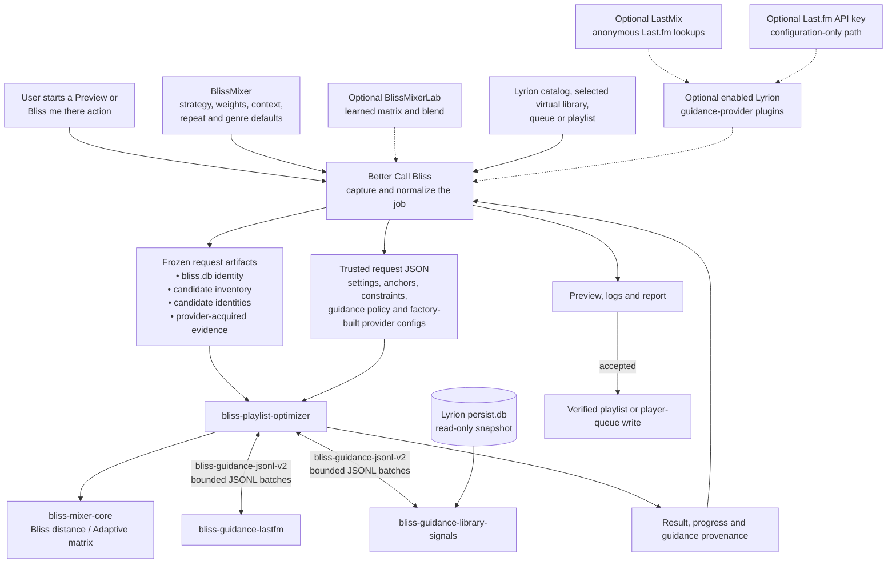
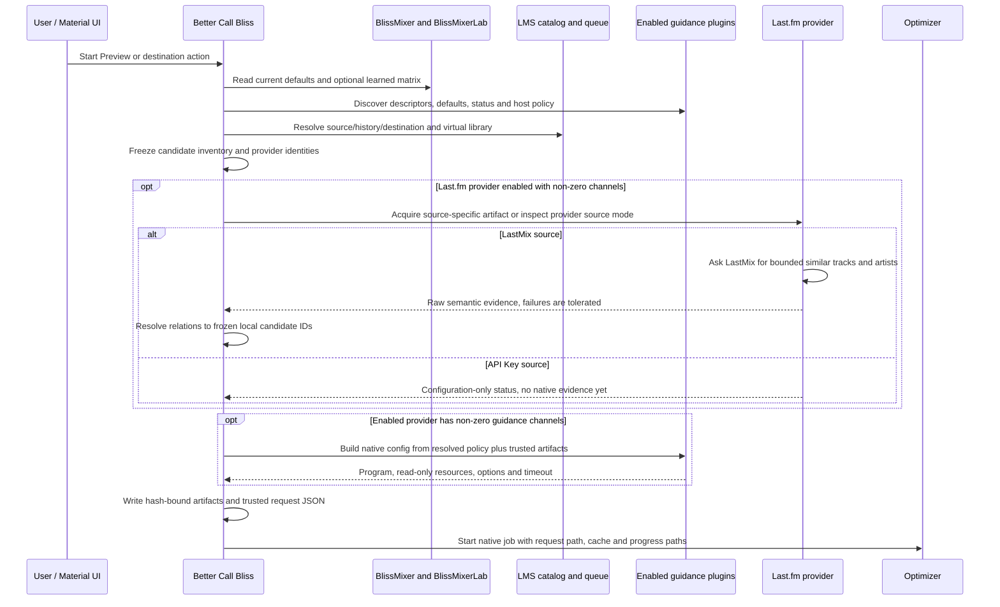
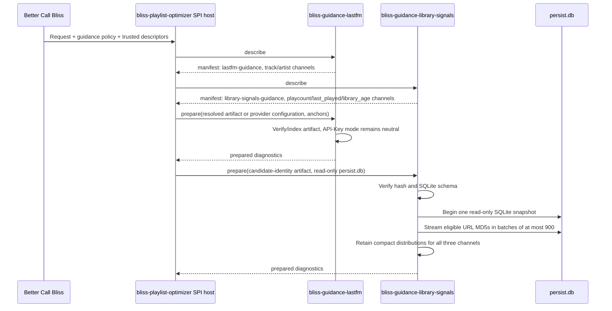
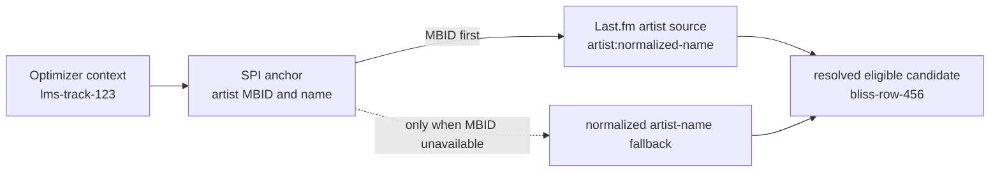
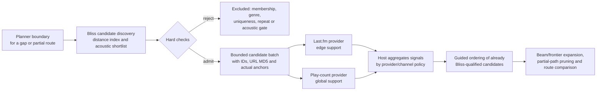
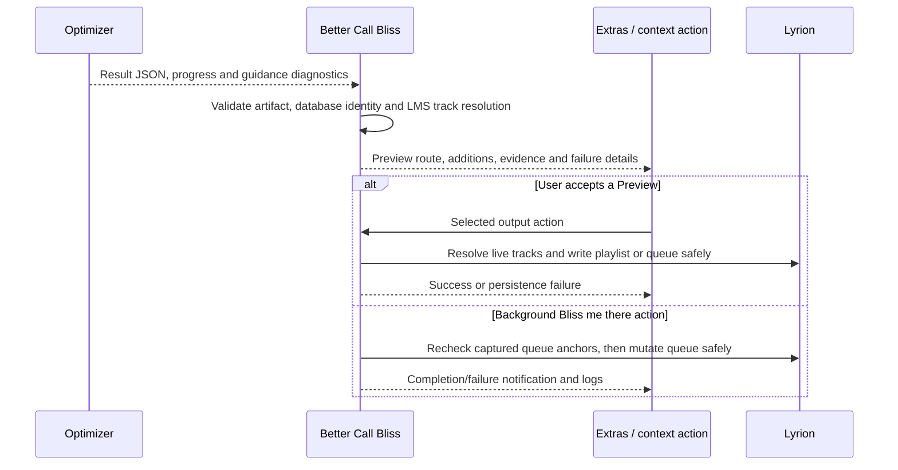

# Guidance data flow

This document describes the shipped, end-to-end information flow for a Better
Call Bliss optimization job that uses the optional Guidance SPI v2 providers.
It is product documentation, not a migration plan. The related
[`bliss-playlist-guidance-spi`](https://github.com/chrober/bliss-playlist-guidance-spi)
contract is host-neutral: Better Call Bliss currently uses it through
[`bliss-playlist-optimizer`](https://github.com/chrober/bliss-playlist-optimizer),
and a future `bliss-mixer` integration may use the same providers while ranking
its own Bliss-derived candidate pool.

The central boundary is intentionally simple: **Bliss decides which tracks and
routes are acoustically valid; guidance can only express a bounded preference
among those already valid choices.** Guidance cannot add remote music, bypass
the selected virtual library or genre policy, relax repeat windows, or turn an
acoustically rejected transition into an accepted one.

## At a glance

```mermaid
flowchart TB
    U["User starts a Preview or<br/>Bliss me there action"] --> B
    BM["BlissMixer<br/>strategy, weights, context,<br/>repeat and genre defaults"] --> B["Better Call Bliss<br/>capture and normalize the job"]
    LAB["Optional BlissMixerLab<br/>learned matrix and blend"] -.-> B
    LMS["Lyrion catalog, selected virtual library,<br/>queue or playlist"] --> B
    GP["Optional enabled Lyrion<br/>guidance-provider plugins"] -.-> B
    LM["Optional LastMix<br/>anonymous Last.fm lookups"] -.-> GP
    API["Optional Last.fm API key<br/>configuration-only path"] -.-> GP

    B --> I["Frozen request artifacts<br/>• bliss.db identity<br/>• candidate inventory<br/>• candidate identities<br/>• provider-acquired evidence"]
    B --> R["Trusted request JSON<br/>settings, anchors, constraints,<br/>guidance policy and factory-built provider configs"]
    I --> O["bliss-playlist-optimizer"]
    R --> O

    O --> C["bliss-mixer-core<br/>Bliss distance / Adaptive matrix"]
    O <-->|"bliss-guidance-jsonl-v2<br/>bounded JSONL batches"| L["bliss-guidance-lastfm"]
    O <-->|"bliss-guidance-jsonl-v2<br/>bounded JSONL batches"| P["bliss-guidance-library-signals"]
    DB[("Lyrion persist.db<br/>read-only snapshot")] --> P

    O --> A["Result, progress and guidance provenance"]
    A --> B
    B --> V["Preview, logs and report"]
    V -->|"accepted"| W["Verified playlist or player-queue write"]
```

Better Call Bliss talks to LMS, the browser UI, and playlist or queue
persistence. It discovers enabled Lyrion guidance providers, resolves their
defaults plus sparse host/job overrides, and asks each enabled provider to
acquire any provider-owned artifact and build its own trusted native
configuration. The Last.fm provider asks LastMix for raw observations in the
currently working path. Its API-Key mode is configuration-only until the direct
acquisition path is released. Only the Library Signals provider opens
`persist.db`. The optimizer itself is network-free and has no
Lyrion-specific SQLite queries.

## Who consumes each setting, and when?

The user-facing settings are read once by Better Call Bliss while it creates a
job. The resulting request is immutable for the optimizer process lifetime.

| Setting family | Owner and source | First consumer | How it affects the job |
| --- | --- | --- | --- |
| Strategy, Static weights, Adaptive context, repeat windows and genre policy | BlissMixer current settings, with Better Call Bliss job overrides | Better Call Bliss, then optimizer | Shapes the acoustic matrix, hard repeat checks, and the frozen eligible candidate library. |
| Learned matrix and blend | Optional BlissMixerLab | Better Call Bliss, then optimizer | Supplies an optional matrix artifact and learned blend for Adaptive scoring. Its absence uses the documented Bliss fallback. |
| Similar-track influence and similar-artist strategy/level | Last.fm provider defaults, then optional Better Call Bliss host/job overrides | Better Call Bliss policy resolver, then optimizer guidance policy | Similar-track is a bounded `lastfm_track` influence. Similar-artist is either a bounded influence or a `target_percent` policy, according to the provider's declared capability. Zero disables its channel. The provider alone owns LastMix-versus-API-Key source selection and the API key. |
| Local listening and library influences, each from -100 to 100; date saturation horizons | Library Signals settings are the provider defaults. Better Call Bliss keeps the provider disabled by default, then offers sparse host and per-job overrides after it is enabled. | Better Call Bliss policy resolver, then the provider factory and optimizer guidance policy | Non-zero values become signed `playcount`, `last_played`, and/or `library_age` policy weights. Better Call Bliss freezes `as_of_unix_seconds`; the provider factory owns trusted `persist.db` and binary resolution and receives the effective horizons. All zero channels leave the native provider unstarted. |
| Candidate library | Active Lyrion virtual library, source exclusions, LMS membership, and captured genre policy | Better Call Bliss, then optimizer | Determines which *generated* tracks are eligible. It is frozen before native search starts. |

Native provider executables do not read preferences or web-form values. A Lyrion
provider owns its saved defaults and turns the resolved policy plus trusted job
context into its native configuration. Better Call Bliss writes its resulting
`guidance_policy` entries and factory-built configuration into the trusted native
request. The optimizer applies policy only when it aggregates provider signals.

For each running job, Better Call Bliss captures a single immutable `as_of`
timestamp. The local provider uses that timestamp, rather than the clock while
later score batches run, and applies the shared Lab-compatible exponential
saturation curve. A never-played row remains distinct from an unknown row;
unknown library-added dates stay neutral.

## Phase 1: Better Call Bliss captures a reproducible job

Before it launches Rust, Better Call Bliss resolves the playlist, queue, or
selected destination into stable local track identities. It snapshots the
applicable history, source anchors, destination/rejoin anchors, output choice,
and effective settings. It also constructs two distinct local-library artifacts:

- `lms-local-candidate-inventory-v1` is the optimizer's allowlist of generated
  candidates. It is the intersection of usable `bliss.db` rows, current local
  LMS tracks, selected virtual-library membership, source exclusions, and the
  captured genre policy.
- `eligible-candidate-identities-v1` is a compact provider-facing identity list.
  It contains the optimizer candidate ID and Lyrion URL MD5 needed by the
  local-library-signals provider. It does not contain decoded Bliss feature vectors.

The optimizer validates these hash- and database-bound artifacts. It can use a
private decoded-library cache, but a changed `bliss.db` or LMS library scan is a
safe cache miss and the plugin revalidates live LMS objects before persistence.

```mermaid
sequenceDiagram
    participant UI as User / Material UI
    participant B as Better Call Bliss
    participant M as BlissMixer and BlissMixerLab
    participant L as LMS catalog and queue
    participant G as Enabled guidance plugins
    participant X as Last.fm provider
    participant O as Optimizer

    UI->>B: Start Preview or destination action
    B->>M: Read current defaults and optional learned matrix
    B->>G: Discover descriptors, defaults, status and host policy
    B->>L: Resolve source/history/destination and virtual library
    B->>B: Freeze candidate inventory and provider identities
    opt Last.fm provider enabled with non-zero channels
        B->>X: Acquire source-specific artifact or inspect provider source mode
        alt LastMix source
            X->>X: Ask LastMix for bounded similar tracks and artists
            X-->>B: Raw semantic evidence, failures are tolerated
            B->>B: Resolve relations to frozen local candidate IDs
        else API Key source
            X-->>B: Configuration-only status, no native evidence yet
        end
    end
    opt Enabled provider has non-zero guidance channels
        B->>G: Build native config from resolved policy plus trusted artifacts
        G-->>B: Program, read-only resources, options and timeout
    end
    B->>B: Write hash-bound artifacts and trusted request JSON
    B->>O: Start native job with request path, cache and progress paths
```

### Last.fm acquisition is provider-owned before the optimizer starts

The separately installed Last.fm provider owns the source choice and any
credential. In **LastMix** mode it asks LastMix for bounded similar-track and
similar-artist observations for the relevant source tracks and artists. Better
Call Bliss resolves returned artist, title, and available MBID data against the
frozen local candidate inventory, then writes successful local matches as the
hash-bound `resolved-lastfm-evidence-v1` artifact.

In **API Key** mode the provider currently exposes the settings and secret-
handling surface but does not yet perform native Last.fm HTTP/cache acquisition.
The selected mode therefore contributes neutral guidance until that follow-up
implementation is released. The key is not written to optimizer requests,
artifacts, logs, progress, or results. In LastMix mode a remote, unresolved,
stale, or non-LMS track is not a native candidate. Missing network access, rate
limiting, or provider failure leaves the evidence partial or absent and the job
continues with Bliss alone.

## Phase 2: the optimizer starts providers through the host-neutral SPI

The request contains factory-built trusted executable paths, timeouts, immutable
artifact descriptors, read-only resources, and the policy weights. The optimizer
starts only configured providers. It first checks each provider's `describe` manifest
for SPI version `2`, the host-neutral protocol name
`bliss-guidance-jsonl-v2`, its expected provider ID, and supported channels.

```mermaid
sequenceDiagram
    participant B as Better Call Bliss
    participant O as bliss-playlist-optimizer SPI host
    participant LF as bliss-guidance-lastfm
    participant LS as bliss-guidance-library-signals
    participant DB as persist.db

    B->>O: Request + guidance policy + trusted descriptors
    O->>LF: describe
    LF-->>O: manifest: lastfm-guidance, track/artist channels
    O->>LS: describe
    LS-->>O: manifest: library-signals-guidance, playcount/last_played/library_age channels

    O->>LF: prepare(resolved artifact or provider configuration, anchors)
    LF->>LF: Verify/index artifact, API-Key mode remains neutral
    LF-->>O: prepared diagnostics

    O->>LS: prepare(candidate-identity artifact, read-only persist.db)
    LS->>LS: Verify hash and SQLite schema
    LS->>DB: Begin one read-only SQLite snapshot
    LS->>DB: Stream eligible URL MD5s in batches of at most 900
    LS->>LS: Retain compact distributions for all three channels
    LS-->>O: prepared diagnostics
```

Provider failure is advisory. A bad manifest, timeout, malformed JSONL response,
artifact hash mismatch, unavailable Last.fm data, or SQLite problem disables
only the affected provider for that job. The optimizer records the diagnostic
and continues with Bliss-only search.

### What each provider collects and retains

| Provider | Data acquisition | `prepare` work | `score` work |
| --- | --- | --- | --- |
| `bliss-guidance-lastfm` | Its Lyrion provider owns the selected source. In LastMix mode it returns raw observations to Better Call Bliss for local resolution. API Key mode is currently configuration-only; direct acquisition is a follow-up. | Verifies and indexes resolved Last.fm relations by source, local candidate, and channel. It maps host track anchors to Last.fm artist source IDs from artist MBIDs, with a normalized-name fallback only when needed. | Expands global and edge track context through that prepared mapping, reads only the bounded candidate batch, and emits positive `lastfm_track` and/or `lastfm_artist` signals where evidence exists. API-Key mode currently emits no evidence. |
| `bliss-guidance-library-signals` | Its separately installed Lyrion provider owns defaults, resolves its own binary and trusted read-only `persist.db` path, and returns the configuration to Better Call Bliss. Better Call Bliss does not build a full-library signal JSON file. | Opens one read-only SQLite snapshot; streams the frozen eligible identity population to build compact `playcount`, `last_played`, and `library_age` distributions. | Looks up only uncached URL MD5s from the bounded candidate batch in the same snapshot, then emits the available normalized signals. Missing persistent rows and missing `added` values are neutral. |

Each distribution is calculated from the complete frozen eligible candidate
population so that a candidate's percentile is comparable across planner
batches. The provider does **not** retain a whole-library `urlmd5 -> signals`
map; it keeps distributions plus a bounded cache of values actually requested
during scoring. It deliberately does not use Alternative Play Count (APC);
APC-based guidance is separate future provider work.

### Why Last.fm artist evidence needs an identity bridge

The optimizer's route context always consists of local track IDs. Last.fm
artist relations cannot use those IDs directly: the artifact's artist edge is
keyed by its Last.fm artist source ID. Better Call Bliss supplies the missing
cross-source information as SPI anchors during provider preparation.

```mermaid
flowchart LR
    T["Optimizer context<br/>lms-track-123"] --> A["SPI anchor<br/>artist MBID and name"]
    A -->|MBID first| L["Last.fm artist source<br/>artist:normalized-name"]
    A -.->|only when MBID unavailable| N["normalized artist-name fallback"]
    L --> C["resolved eligible candidate<br/>bliss-row-456"]
    N --> C
```

The Last.fm provider creates this mapping once in `prepare` and reports its
size as `track_artist_mappings`. During `score`, it expands both global
`context_track_ids` and the two edge endpoints through the prepared mapping,
while retaining the original track IDs for recording-level relationships. It
returns only the already-resolved `bliss-row-*` candidate IDs. Thus an artist
source ID never becomes a playlist track, route anchor, or new candidate; it is
only the internal bridge between local Lyrion metadata and frozen Last.fm
evidence.

## Phase 3: Bliss-first candidate search, then bounded guidance

For every route, bridge, extension, or destination boundary, the optimizer
applies its hard rules first. It loads and scores usable Bliss rows, removes
tracks outside the frozen candidate library, enforces genre and repeat windows,
and creates a bounded acoustic shortlist. Guidance never runs over all 64k or
200k library tracks merely to gather diagnostics.

```mermaid
flowchart LR
    A["Planner boundary<br/>for a gap or partial route"] --> B["Bliss candidate discovery<br/>distance index and acoustic shortlist"]
    B --> C{"Hard checks"}
    C -->|"reject"| R["Excluded: membership, genre,<br/>uniqueness, repeat or acoustic gate"]
    C -->|"admit"| S["Bounded candidate batch<br/>with IDs, URL MD5 and actual anchors"]

    S --> LF["Last.fm provider<br/>edge support"]
    S --> PC["Play-count provider<br/>global support"]
    LF --> G["Host aggregates signals<br/>by provider/channel policy"]
    PC --> G
    G --> P["Guided ordering of already<br/>Bliss-qualified candidates"]
    P --> N["Beam/frontier expansion,<br/>partial-path pruning and route comparison"]
```

The actual SPI `score` request contains only the candidates under consideration
at that planner boundary and its real context: a global or edge scope, left and
right anchors where applicable, and a small ordered context suffix. Providers
may return signals only for IDs in that request. Omitted IDs are neutral.

The optimizer aggregates only declared channels:

- `lastfm_track` and `lastfm_artist` are independent positive supporting
  signals. Their per-job percentages become separate best-effort target shares.
  The optimizer expands its Bliss-ranked pool at least tenfold while either is
  active, then derives deterministic calibrated multipliers inside that bounded
  pool. Overlapping evidence contributes to both targets; Bliss constraints and
  acoustic qualification always remain authoritative.
- `playcount`, `last_played`, and `library_age` are normalized unary signals.
  Their signed per-job policy weights determine whether lower or higher values
  are preferred. `last_played = 0` represents never played; a missing
  persistence row or missing library-age timestamp is neutral rather than
  ranked.

After aggregation, the adjustment participates in the existing planner's
candidate ordering, path expansion, beam/frontier pruning, and completed-route
comparison. It is a tie-breaking or near-tie preference inside the acoustic
shortlist—not a second candidate generator and not a post-hoc Perl reranker.
Stable identity ordering and the job generation seed preserve reproducibility.

## Phase 4: results return to Better Call Bliss

The optimizer writes one final JSON result to stdout, a structured failure to
stderr, and best-effort progress to the job-local sidecar. Its result contains
the selected route, acoustic quality information, provider preparation and
score diagnostics, an aggregate guidance-signal count, and stable opaque
candidate identities. It does not return the providers' raw evidence artifacts.
The provider sessions are then closed; the local-library-signals provider
releases its SQLite snapshot and bounded cache.

```mermaid
sequenceDiagram
    participant O as Optimizer
    participant B as Better Call Bliss
    participant UI as Extras / context action
    participant L as Lyrion

    O-->>B: Result JSON, progress and guidance diagnostics
    B->>B: Validate artifact, database identity and LMS track resolution
    B-->>UI: Preview route, additions, evidence and failure details
    alt User accepts a Preview
        UI->>B: Selected output action
        B->>L: Resolve live tracks and write playlist or queue safely
        B-->>UI: Success or persistence failure
    else Background Bliss me there action
        B->>L: Recheck captured queue anchors, then mutate queue safely
        B-->>UI: Completion/failure notification and logs
    end
```

The final LMS write remains outside all Rust binaries. Better Call Bliss
rechecks the current database identity and resolves opaque candidate IDs to live
LMS objects before it creates or overwrites a playlist or changes a player
queue. A stale result therefore fails safely rather than writing a route against
changed library state.

## Current boundary and `bliss-mixer` reuse

The protocol is deliberately named `bliss-guidance-jsonl-v2`, not after the
playlist optimizer. Its reusable division of responsibility is:

| Component | Current responsibility | `bliss-mixer` status |
| --- | --- | --- |
| Better Call Bliss | Lyrion settings, provider discovery, local identity resolution for provider artifacts, job lifecycle, and persistence | Not required for a standalone future mixer host. |
| Guidance providers | Interpret their own trusted artifact/resource and emit bounded signals | The same provider executables and channel contracts can be reused. |
| Host | Maintains the Bliss-first candidate pool, invokes providers on bounded batches, and aggregates signals under host policy | `bliss-mixer` 0.11.4 exposes the first native Library Signals host endpoint and `selection_trace_v1`; Lab already sends enabled native-provider DSTM pools to it while retaining its own selection policy and log formatter. |

The first native `bliss-mixer` host endpoint preserves the same ordering:
derive and admit candidates through Bliss first, then ask optional providers to
influence their ranking. Lab's existing native-provider DSTM integration must
not duplicate Better Call Bliss's Last.fm acquisition path or turn guidance
into a substitute for acoustic evidence.

## Related documentation

- [Architecture boundary](ARCHITECTURE.md): plugin/native ownership, candidate
  inventory, cache, and persistence safeguards.
- [Playlist modes and options](../ALGORITHMS.md): what each workflow does and
  how it chooses candidates.
- [Guidance SPI v2](https://github.com/chrober/bliss-playlist-guidance-spi/blob/main/SPI.md): normative JSONL protocol and schemas.
- [Last.fm Lyrion provider](https://github.com/chrober/lms-guidance-lastfm):
  settings, LastMix/API Key source ownership, discovery, and trusted native
  configuration.
- [Last.fm native provider](https://github.com/chrober/bliss-guidance-lastfm):
  artifact-backed guidance behavior and the planned direct API path.
- [Library Signals Lyrion provider](https://github.com/chrober/lms-guidance-library-signals):
  provider discovery, settings/defaults, trusted native configuration, and
  read-only SQLite snapshot behavior.
