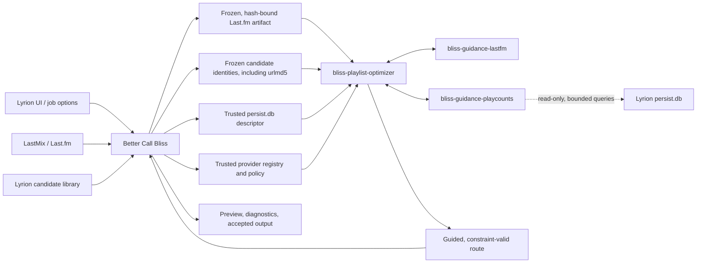

# Guidance SPI migration design

## Intent and success criteria

Better Call Bliss must use external, non-acoustic knowledge to **guide** candidate choice while keeping Bliss the authority for acoustic distance, eligible-library membership, route feasibility, and repeat windows. The first supported guidance sources are Last.fm track/artist relations and LMS play counts.

The target design replaces the current direct semantic and play-count selection path in a Better Call Bliss migration branch. It must avoid parallel ranking implementations, avoid sending a 64k–200k-track library through a child-process pipe, preserve deterministic results, and report which guidance actually affected a result. The current main branches remain unchanged until the migration is proven.

The migration deliberately uses a hybrid acquisition model:

- Last.fm relations remain collected by Better Call Bliss through LastMix and are supplied as an immutable artifact.
- Play counts are read on demand by the play-count guidance provider from Lyrion's `persist.db`, using only trusted paths and track identities supplied by Better Call Bliss.
- The optimizer remains provider-neutral. It coordinates guidance through the SPI but contains neither Last.fm acquisition logic nor Lyrion-specific SQL.

The migration is successful when the direct ranking path has been removed, no per-job full-library play-count JSON artifact is generated, guidance is applied consistently at shared planner boundaries, and provider failures still leave a valid Bliss-only result.

## Terms

| Term | Meaning |
| --- | --- |
| **Evidence** | An observation used by guidance, such as a frozen Last.fm relation or a play count read from a bounded Lyrion database snapshot. |
| **Evidence artifact** | Immutable, versioned, checksum-bound evidence prepared before native optimization, such as resolved Last.fm relations. |
| **Trusted resource** | A plugin-selected read-only data source that a provider may query during a job, such as Lyrion's `persist.db`. It is never supplied by an LMS form field. |
| **Candidate identity artifact** | A compact, hash-bound mapping between frozen eligible candidates and identities required by providers, including Lyrion `urlmd5`. |
| **Guidance provider** | A Rust process that consumes declared evidence artifacts or trusted resources and returns bounded candidate-level preference signals. |
| **Guidance signal** | A signed, confidence-weighted preference for a candidate within a declared channel. |
| **Guidance aggregation** | The optimizer's deterministic combination of Bliss ranking and permitted provider signals. |
| **Reranking** | Applying the aggregated guidance adjustment to an acoustically eligible candidate ordering. |

Bliss hard constraints always run before guidance. Guidance can neither admit a non-local track nor allow a repeat-window violation nor turn an acoustically invalid route into a valid one.

## Architecture decision

The first migration keeps **Last.fm evidence acquisition** inside Better Call Bliss but moves **play-count acquisition**, evidence interpretation, and candidate guidance into independent Rust providers.

This division is deliberate:

- Last.fm acquisition continues to use LastMix's in-process Perl API, established caching, anonymous user access, and failure tolerance. Better Call Bliss resolves the returned relations against the frozen candidate library before writing a versioned artifact.
- Play counts already reside locally in Lyrion's SQLite persistence database. Copying the entire library into a new JSON artifact for every job adds avoidable database work, serialization, disk I/O, process input, and memory usage.
- Better Call Bliss owns the source snapshot, selected virtual library, trusted Lyrion paths, user settings, job directory, scan-safety rules, status reporting, and final diagnostics.
- The optimizer owns planner timing and knows which bounded candidate shortlists actually need guidance.
- Providers own source-specific interpretation and access. The optimizer does not contain Last.fm rules or Lyrion SQL.



The Rust providers are launched by the optimizer only from plugin-owned, trusted configuration. No executable path, arguments, artifact path, database path, or provider option may originate from an LMS form field.

A future acquisition adapter may replace LastMix with direct Rust HTTP access, but direct Last.fm networking is not part of this migration. Likewise, an official efficient Lyrion batch API could later replace direct SQLite reads behind the play-count provider without changing the optimizer-facing SPI.

## Responsibilities

### Better Call Bliss

- Captures an immutable source/history snapshot and the currently selected candidate-library boundary.
- Collects Last.fm evidence through LastMix and resolves raw relations to the frozen local candidate inventory.
- Writes the resolved Last.fm evidence as a versioned, checksum-bound job artifact.
- Produces or reuses a compact, checksum-bound candidate identity artifact containing stable candidate identity and Lyrion `urlmd5` for every eligible candidate.
- Supplies the trusted `persist.db` path and expected Lyrion schema identity without exposing either to user input.
- Maps per-job user options to a trusted provider policy: enabled providers, per-channel weights, signed play-count preference, limits, and timeouts.
- Starts the optimizer, renders guidance provenance, and owns failure presentation, playlist persistence, and queue writes.

Better Call Bliss stops scanning all local tracks for play counts and stops writing `play-counts.json`. It does **not** score or rerank candidate choices once this branch is migrated. `CandidateGuidance.pm` remains an identity-resolution and Last.fm acquisition helper, not a selection engine.

### Guidance SPI and providers

The SPI defines a process boundary. Providers interpret their declared artifacts or trusted resources and return normalized signals; they do not know planner implementation details and do not mutate the route.

- `bliss-guidance-lastfm` maps resolved, frozen Last.fm track and artist relations to edge- or global-scoped signals.
- `bliss-guidance-playcounts` validates and opens Lyrion's `persist.db` read-only, establishes a bounded job snapshot, and maps counts for requested candidates to signed preference signals.

Each provider validates its declared inputs before use. Missing, stale, malformed, locked, or unavailable input is neutral and recorded diagnostically.

The play-count provider must:

- use `rusqlite` read-only mode and `PRAGMA query_only=ON`;
- use a finite busy timeout and bounded `IN (...)` batches keyed by `urlmd5`;
- validate the expected tables and columns before scoring;
- establish one consistent SQLite snapshot per prepared job and release it on completion, cancellation, timeout, or provider failure;
- never use SQLite's `immutable=1` option for a live Lyrion database or ignore its WAL state;
- cache counts already requested during the job; and
- return neutral signals if the database or schema is unavailable rather than failing the Bliss optimization.

### Optimizer

- Validates the request, source/history, Bliss database identity, and eligible local inventory.
- Uses Bliss scoring to construct and evaluate all candidate routes.
- Loads the frozen candidate identity artifact and attaches only provider-required identities to bounded shortlist requests.
- Starts only configured providers, calls them on candidate batches a planner actually evaluates, and deterministically aggregates their signals into bounded reranking adjustments.
- Records provider availability, source/snapshot state, cache state, timing, signal counts, applied channel contributions, and neutralized failures in the native result.

The optimizer does not fetch Last.fm data and contains no Lyrion-specific database queries. Only the play-count provider opens `persist.db`.

## SPI v2 shape

The existing v1 experiment prepares every provider with full candidates and anchors, then scores the full decoded library for diagnostics. The migration introduces a breaking v2 contract; no compatibility shim is needed on the migration branches.

### Prepare

`prepare` contains job identity, trusted provider options, and only the input descriptors needed by that provider. Inputs are typed as immutable artifacts or trusted read-only resources.

A Last.fm provider preparation uses a hash-bound artifact:

```json
{
  "type": "prepare",
  "spi_version": 2,
  "job_id": "preview-…",
  "options": {
    "track_weight_percent": 75,
    "artist_weight_percent": 75
  },
  "artifacts": [
    {
      "kind": "resolved-lastfm-evidence-v1",
      "path": "/private/job/semantic-evidence.json",
      "sha256": "…"
    }
  ]
}
```

A play-count provider preparation uses a trusted database resource and the frozen eligible identity population:

```json
{
  "type": "prepare",
  "spi_version": 2,
  "job_id": "preview-…",
  "options": {
    "preference_percent": -40
  },
  "artifacts": [
    {
      "kind": "eligible-candidate-identities-v1",
      "path": "/private/cache/candidate-identities.json",
      "sha256": "…"
    }
  ],
  "resources": [
    {
      "kind": "lms-persist-sqlite-v1",
      "path": "/private/lms/persist.db",
      "access": "read-only"
    }
  ]
}
```

Artifact descriptors are hash-verified. A live SQLite resource cannot be treated as an immutable file and is instead validated by type, trusted path, schema, read-only access, and provider-reported snapshot metadata.

The Last.fm provider opens and indexes only its evidence artifact during `prepare`. The play-count provider opens its database snapshot and prepares the normalization distribution described below. Neither provider receives the decoded Bliss feature library.

### Score

The optimizer sends a bounded candidate batch together with the planner's actual context. The batch contains stable candidate identity and only provider-needed fields. For play-count guidance this includes `lms_urlmd5`; for Last.fm it includes the identities needed to match the resolved artifact. An edge request identifies its frozen left and right anchor and may include a small ordered context suffix.

Providers return only signals for IDs in that batch. Every signal declares a stable **channel**, initially `lastfm_track`, `lastfm_artist`, or `playcount`, and has bounded `score` (`-1..1`) and `confidence` (`0..1`). Missing signals are neutral.

Only bounded shortlists cross the JSONL process boundary. The candidate identity artifact is opened through its verified artifact descriptor during preparation and is never serialized wholesale through provider standard input.

### Stable play-count normalization

Play-count influence currently uses a percentile rather than a raw count. The population for that percentile is the frozen eligible candidate library selected for the job, not the complete LMS catalog and not each individual shortlist.

The play-count provider therefore performs one streaming preparation pass over the eligible `urlmd5` identities and queries their counts from the same read-only SQLite snapshot in bounded batches. It retains a compact count distribution or histogram, not a second per-track copy of the candidate library. During `score`, it retrieves and caches exact counts only for shortlisted candidates and converts them against that frozen distribution.

This rule is essential: calculating percentiles independently for separate shortlists would make scores from different planner steps incomparable. Reading the normalization population and all later shortlist values from the same snapshot also prevents concurrent play-count updates from changing a job halfway through.

### Deterministic aggregation

The host computes a bounded adjustment per candidate:

```text
adjustment = clamp(sum(channel_weight × score × confidence), -cap, +cap)
guided_loss = bliss_loss - adjustment
```

Positive guidance improves an otherwise equal candidate by lowering its normalized Bliss loss; negative guidance de-boosts it. Exact normalization and caps will be specified in the implementation plan and tested as a shared optimizer function. Stable tie breakers remain Bliss candidate identity/order, never provider process order or Rayon scheduling.

Last.fm track and artist channels retain separate Better Call Bliss settings. Play-count guidance retains its signed preference: negative values prefer less-played tracks, positive values prefer more-played tracks, and zero disables the provider. This is a difference in available data, not in architectural treatment: both sources yield the same bounded guidance signal model.

## Future Last.fm provider-owned acquisition

The initial migration deliberately keeps Last.fm acquisition in Better Call Bliss through LastMix. A later SPI revision may move acquisition into `bliss-guidance-lastfm`, making the provider responsible for querying, caching, validating, and interpreting Last.fm responses.

Such a provider must not make an HTTP request for every candidate passed to `score`. Network acquisition belongs in a distinct preparation or acquisition phase:

1. The optimizer supplies the bounded set of source tracks, artists, anchors, MBIDs, and normalized fallback names needed by the current job.
2. The provider resolves those queries from its cache or Last.fm, with explicit concurrency, rate, retry, and timeout limits.
3. The provider freezes the resulting relations for the lifetime of the job and records their cache/freshness and response identity.
4. Later `score` calls use only that frozen in-memory evidence, so route search remains fast and internally deterministic.
5. Offline operation, rate limiting, invalid responses, or exhausted time budgets disable or partially neutralize Last.fm guidance without failing Bliss optimization.

Potential advantages are:

- clearer ownership: one component owns Last.fm transport, caching, normalization, and guidance interpretation;
- less Perl-side orchestration and no intermediate Last.fm artifact generated by Better Call Bliss;
- reusable Last.fm guidance outside Lyrion and Better Call Bliss;
- targeted acquisition for only the source tracks and artists relevant to the job;
- native timing, cache, retry, and failure diagnostics in the same provider result; and
- an opportunity to centralize bounded HTTP concurrency and persistent cache behaviour.

Potential disadvantages and risks are:

- Last.fm similarity methods require an application API key even though they do not require a user's Last.fm account or authenticated session; LastMix currently hides this integration detail;
- LastMix's established caching, request normalization, error tolerance, and compatibility would need to be replicated or deliberately replaced;
- network access introduces variable latency, rate limits, temporary failures, proxy and certificate concerns, and additional cancellation work in a native process;
- live Last.fm responses can change, so reproducibility requires freezing and identifying the acquired response before route scoring begins;
- track and artist names alone are ambiguous, while MBID availability is incomplete; the provider still needs a well-defined identity and fallback-matching contract;
- outbound requests have privacy and operational implications that must be visible to administrators; and
- an HTTP/TLS client and persistent cache increase binary size and platform-testing scope.

Before adopting this direction, a separate design must compare it with the LastMix-backed path using cache-hit latency, cold-query latency, failure behaviour, release packaging, and result reproducibility. The provider-owned design should replace the LastMix-backed acquisition path rather than create two simultaneously active Last.fm implementations.

## Request, artifact, and resource model

Better Call Bliss supplies a provider-policy list in the optimizer request. The list selects only bundled, trusted provider IDs and records job-normalized options plus verified artifact and resource descriptors. It never exposes an arbitrary executable or resource field to the UI.

The optimizer verifies every artifact descriptor before starting providers, and providers verify the inputs they consume. Artifact bytes must remain immutable during the native process lifetime; a changed hash disables that provider rather than weakening the job.

Trusted resources have different integrity semantics. Better Call Bliss selects their path, the provider enforces read-only access and validates the schema, and the result records sufficient snapshot metadata for diagnostics. A database resource is never copied or hashed as though it were a job artifact.

The native result reports both:

- **observed guidance**: provider/channel signals returned for candidate batches; and
- **applied guidance**: signals that changed a final or shortlisted candidate's rank, including aggregate adjustment and concise rationale.

This allows the Perl preview to distinguish “Last.fm was available” from “Last.fm actually influenced this proposed addition,” and likewise distinguish “play counts were available” from “play-count preference changed this choice.”

## Planner integration

Guidance is invoked at shared candidate-ranking boundaries rather than separately inside every mode. This preserves a single implementation for all planners:

- destination routes and the shared A-to-B path engine;
- preserved-order gap repair;
- automatic and exact-count extensions;
- spacing-track repair; and
- reordered/extended playlist planning.

Each boundary passes only the currently evaluated candidate shortlist. Providers are never called over the whole library merely to generate diagnostics. The planner first applies membership, uniqueness, genre/virtual-library, and repeat constraints, then Bliss scoring and acceptance gates, then bounded guidance reranking among the remaining candidates.

## Non-functional requirements

### Runtime performance and scalability

- The design must remain practical for libraries of at least 200,000 tracks; a 64,000-track library is not treated as an exceptional upper bound.
- Per-scoring-call provider traffic must be proportional to the bounded shortlist, not the whole library.
- Play-count preparation may make one streaming pass over the eligible identity population to establish a stable distribution, but must not generate, write, parse, or transmit a full-library play-count JSON artifact.
- Provider processes are prepared once per job and reused at every relevant planner boundary. They must not be restarted for each gap, route depth, or shortlist.
- Database access uses indexed `urlmd5` lookups, bounded batches, and a job-local value cache. It must avoid one SQL query or one LMS API round trip per candidate.
- Independent CPU-bound work should use multiple cores through Rayon or an equivalent bounded worker pool where profiling demonstrates a benefit. Appropriate candidates include Bliss distance evaluation, independent shortlist scoring, and independent provider-response aggregation.
- Parallel execution must use deterministic collection and stable tie-breaking. Results must not depend on worker count, task completion order, or hash-map iteration order.
- I/O-bound work, SQLite access, and provider process calls must not be parallelized without bounds. More threads must not create database contention or unbounded child-process requests.
- The implementation plan must establish measured baselines for provider preparation, shortlist scoring, and complete destination-route and extension jobs on both Raspberry Pi-class hardware and a desktop/server system.

### Memory and data movement

- The optimizer holds one decoded Bliss candidate inventory. Providers must not receive or reconstruct additional full copies of the Bliss feature library.
- The candidate identity artifact contains compact identities only; it must not duplicate Bliss features or rich LMS metadata.
- The play-count provider retains a compact normalization histogram/distribution and only a cache of counts actually requested during scoring. It must not retain a second full-library candidate object graph.
- JSONL request and response sizes are bounded by configured shortlist and batch limits. Diagnostics must be aggregated rather than accumulating every rejected candidate event in memory.
- Large inputs are processed incrementally or in bounded chunks. Reading an entire candidate, database, or evidence file into one unbounded byte buffer is not acceptable.
- Peak additional memory attributable to guidance must be measured in the 200,000-track performance harness and must grow with compact eligible identities plus configured shortlist/cache bounds, not with duplicated acoustic feature vectors.

### Responsiveness, cancellation, and observability

- Better Call Bliss must surface immediate preparation status before native work starts, followed by unified optimizer/provider progress.
- Cancellation must terminate outstanding provider work, close the SQLite snapshot, and release child processes promptly.
- Every provider call has a finite timeout. A non-retryable provider failure disables that provider for the remainder of the job instead of repeatedly paying the same cost.
- Progress and diagnostics include provider preparation time, database query time, candidate batch count, candidates scored, cache hits/misses, signal count, snapshot/freshness state, failure count, and whether returned guidance was observed or applied.
- INFO logging must not expose private track paths or excessive per-candidate detail; DEBUG may provide bounded diagnostic samples.

### Reliability and compatibility

- Any unavailable provider, malformed protocol response, timeout, artifact mismatch, database lock, schema mismatch, or no-match result is neutral; the Bliss-only job continues without relaxing hard constraints.
- The play-count provider must tolerate concurrent LMS writes through SQLite's supported WAL/read-snapshot semantics and must release its snapshot after a bounded job lifetime.
- Provider inputs and outputs are versioned and schema-validated. Unsupported versions fail neutral with actionable diagnostics.
- Last.fm collection remains asynchronous and tolerant of temporary Internet or service failure.

## Migration scope and deletion rule

The migration is intentionally isolated:

| Repository | Branch | Change |
| --- | --- | --- |
| `lms-better-call-bliss` | `feature/guidance-spi-migration` | Fully replace direct Last.fm/play-count selection wiring; retain LastMix acquisition, provide trusted resources and frozen identities, and delete full-library play-count export. |
| `bliss-playlist-optimizer` | successor to `feature/guidance-addons` | Implement SPI v2 and shared guided candidate-ranking integration without embedding source-specific acquisition logic. |
| `bliss-playlist-guidance-spi` | dedicated v2 work | Publish the breaking v2 protocol, artifact/resource descriptors, candidate identities, and schemas. |
| `bliss-guidance-lastfm` | dedicated v2 work | Consume resolved frozen semantic evidence and emit channelized signals. |
| `bliss-guidance-playcounts` | dedicated v2 work | Query trusted Lyrion persistence data read-only for bounded candidates and emit normalized, signed signals. |

When the migration branch is complete, the direct semantic-evidence and play-count selection/reranking path is deleted from that branch. This includes Better Call Bliss's full-library play-count scan and `play-counts.json`, and the optimizer's direct play-count artifact loader and ranking path. The old main branches remain the stable implementation until the new path passes functional, determinism, and performance tests; no request-level dual mode is retained in the migration branch.

The initial migration uses standard Lyrion play counts from `tracks_persistent`. Alternative Play Count is not a required dependency. The provider boundary should nevertheless permit a later, explicitly configured data-source implementation to use `alternativeplaycount.playCount` and potentially `skipCount` or `dynPSval`, without changing planner or aggregation code.

## Acceptance tests

The implementation plan must include at least these regression checks:

1. A no-provider job is behaviorally Bliss-only and deterministic.
2. Provider timeout, protocol failure, changed artifact hash, empty evidence, missing database, database lock, and schema mismatch remain neutral without relaxing hard constraints.
3. Last.fm track and artist channels independently change eligible candidate order when enabled; disabled channels cannot influence it.
4. Positive and negative play-count guidance produce the expected opposite preference while zero is neutral.
5. Guidance cannot select a candidate outside the frozen virtual-library/local inventory or violate repeat rules.
6. Better Call Bliss does not create a full-library play-count artifact, and the optimizer does not serialize the full Bliss library to provider `prepare`.
7. Score batches contain only the bounded candidates requested at real planner ranking boundaries, and the play-count provider queries only those candidates after its one normalization pass.
8. Play-count percentiles use the complete frozen eligible candidate population and remain comparable across separate score batches.
9. A concurrent LMS play-count update cannot change scores inside an already prepared job snapshot.
10. The same request produces byte-stable route/provenance output across repeated runs and supported Rayon worker counts.
11. End-to-end Better Call Bliss preview reports whether each provider was unavailable, neutral, observed, or applied.
12. Cancellation closes provider processes and the SQLite read snapshot without waiting for the normal job timeout.
13. A 200,000-track fixture and performance harness verify bounded provider memory, bounded JSONL payloads, indexed/batched database access, multi-core scaling where applicable, and measured latency for destination routes and playlist extensions.
14. Memory profiling confirms that providers do not duplicate the decoded Bliss feature inventory and that play-count memory is limited to the compact distribution plus bounded requested-value cache.

## Out of scope

- Direct Last.fm network access from Rust providers in the first migration; the provider-owned acquisition design above is a possible later SPI revision.
- A new Lyrion CLI/JSON-RPC batch endpoint for play counts.
- Alternative Play Count signals in the first migration.
- ListenBrainz or other new guidance providers.
- Changing Bliss acoustic feature extraction or `bliss-mixer-core` distance semantics.
- User-configurable external executable or resource paths.
- Retaining the v1 experimental SPI or direct selection implementation inside the migration branch.
