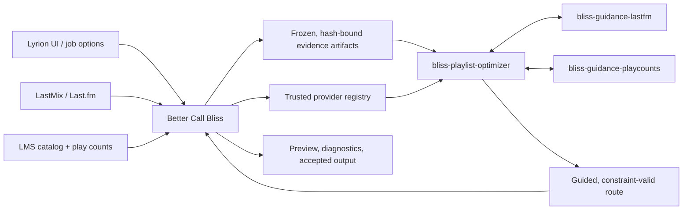

# Guidance SPI migration design

## Intent and success criteria

Better Call Bliss must use external, non-acoustic knowledge to **guide** candidate choice while keeping Bliss the authority for acoustic distance, eligible-library membership, route feasibility, and repeat windows. The first supported guidance sources are Last.fm track/artist relations and LMS play counts.

The target design replaces the current direct semantic and play-count selection path in a Better Call Bliss migration branch. It must avoid two parallel ranking implementations, avoid sending a 64k–200k track library through a child-process pipe, preserve deterministic results, and report which guidance actually affected a result. The current main branches remain unchanged until the migration is proven.

## Terms

| Term | Meaning |
| --- | --- |
| **Evidence** | A frozen observation: a Last.fm relation or LMS play-count snapshot. |
| **Guidance provider** | A Rust process which reads frozen evidence and returns bounded, candidate-level preference signals. |
| **Guidance signal** | A signed, confidence-weighted preference for a candidate within a declared channel. |
| **Guidance aggregation** | The optimizer’s deterministic combination of Bliss ranking and permitted provider signals. |
| **Reranking** | Applying the aggregated guidance adjustment to an acoustically eligible candidate ordering. |

Bliss hard constraints always run before guidance. Guidance can neither admit a non-local track nor allow a repeat-window violation nor turn an acoustically invalid route into a valid one.

## Architecture decision

The first migration keeps **evidence acquisition** inside Better Call Bliss and moves **evidence interpretation and candidate guidance** into independent Rust providers. This is deliberate:

- Last.fm acquisition currently uses LastMix’s in-process Perl API, its anonymous-access behaviour, caching, and error tolerance.
- LMS play counts originate in LMS-owned catalog tables and URL-to-Bliss identity mapping. Better Call Bliss already owns their snapshot, cancellation, and scan-safety rules.
- The plugin owns the source snapshot, selected virtual library, user settings, job directory, status reporting, and final diagnostics.

Therefore, a provider receives immutable, hash-bound evidence artifacts; it does not make network requests or query LMS during route search. A later, separately designed acquisition adapter may replace a Better Call Bliss collector, for example with direct Rust HTTP Last.fm access. That is not part of this migration.



The Rust providers are launched by the optimizer only from plugin-owned, trusted configuration. No executable path, arguments, artifact path, or provider option may originate from an LMS form field.

## Responsibilities

### Better Call Bliss

- Captures an immutable source/history snapshot and the currently selected candidate-library boundary.
- Collects Last.fm evidence through LastMix and LMS play counts through LMS-owned data access.
- Resolves raw Last.fm relations to the frozen local candidate inventory, then writes versioned, checksum-bound artifacts in the job directory.
- Maps per-job user options to a trusted provider policy: enabled providers, per-channel weights, signed play-count preference, limits, and timeout.
- Starts the optimizer, renders guidance provenance, and owns failure presentation, playlist persistence, and queue writes.

It does **not** score or rerank candidate choices once this branch is migrated. `CandidateGuidance.pm` remains an identity-resolution/acquisition helper, not a selection engine.

### Guidance SPI and providers

The SPI defines a process boundary only. Providers interpret their declared artifacts and return normalized signals; they do not know planner implementation details and do not mutate the route.

- `bliss-guidance-lastfm` maps resolved Last.fm track and artist relations to edge- or global-scoped signals.
- `bliss-guidance-playcounts` maps a frozen LMS count snapshot to signed candidate preference signals.

Each provider validates its input artifact identity before use. Missing, stale, malformed, or unavailable evidence is neutral and recorded diagnostically.

### Optimizer

- Validates the request, source/history, Bliss database identity, and eligible local inventory.
- Uses Bliss scoring to construct and evaluate all candidate routes.
- Starts only configured providers, calls them on the candidate batches a planner actually evaluates, and deterministically aggregates their signals into bounded reranking adjustments.
- Records provider availability, cache/freshness state, signal counts, applied channel contributions, and neutralized failures in the native result.

The optimizer does not fetch Last.fm data or open LMS catalog databases.

## SPI v2 shape

The existing v1 experiment prepares every provider with full candidates and anchors, then scores the full decoded library for diagnostics. The migration introduces a breaking v2 contract; no compatibility shim is needed on the migration branches.

### Prepare

`prepare` contains only job identity, trusted provider options, and artifact descriptors:

```json
{
  "type": "prepare",
  "spi_version": 2,
  "job_id": "preview-…",
  "options": {
    "track_weight_percent": 75,
    "artist_weight_percent": 75
  },
  "artifacts": [
    {
      "kind": "resolved-lastfm-evidence-v1",
      "path": "/private/job/semantic-evidence.json",
      "sha256": "…"
    }
  ]
}
```

The provider opens and indexes only its own artifact during `prepare`. It receives neither the full decoded Bliss library nor a general candidate inventory.

### Score

The optimizer sends a bounded candidate batch together with the planner’s actual context. The batch includes only stable candidate identity plus provider-needed fields, such as `database_file` for play counts. An edge request identifies its frozen left and right anchor and can include a small ordered context suffix.

Providers return only signals for IDs in that batch. Every signal declares a stable **channel**, initially `lastfm_track`, `lastfm_artist`, or `playcount`, and has bounded `score` (`-1..1`) and `confidence` (`0..1`). Missing signals are neutral.

### Deterministic aggregation

The host computes a bounded adjustment per candidate:

```text
adjustment = clamp(sum(channel_weight × score × confidence), -cap, +cap)
guided_loss = bliss_loss - adjustment
```

Positive guidance therefore improves an otherwise equal candidate by lowering its normalized Bliss loss; negative guidance de-boosts it. Exact normalization and caps will be specified in the implementation plan and tested as a shared optimizer function. Stable tie breakers remain Bliss candidate identity/order, never provider process order or Rayon scheduling.

Last.fm track and artist channels retain separate Better Call Bliss settings. Play-count guidance retains its signed preference: negative values prefer less-played tracks, positive values prefer more-played tracks, and zero disables the provider. This is a difference in available data, not in architectural treatment: both sources yield the same bounded guidance signal model.

## Request and artifact model

Better Call Bliss supplies a provider-policy list in the optimizer request. The list selects only bundled/trusted provider IDs and records job-normalized options plus verified artifact descriptors. It never exposes an arbitrary executable field to the UI.

The optimizer verifies every artifact descriptor before starting providers, and providers verify the descriptor they consume. Artifact bytes must remain immutable during the native process lifetime; a changed hash disables that provider rather than weakening the job.

The native result reports both:

- **observed guidance**: provider/channel signals returned for candidate batches; and
- **applied guidance**: signals that changed a final or shortlisted candidate’s rank, including aggregate adjustment and concise rationale.

This allows the Perl preview to distinguish “Last.fm was available” from “Last.fm actually influenced this proposed addition.”

## Planner integration

Guidance is invoked at shared candidate-ranking boundaries rather than separately inside every mode. This preserves a single implementation for all planners:

- destination routes and the shared A-to-B path engine;
- preserved-order gap repair;
- automatic and exact-count extensions;
- spacing-track repair; and
- reordered/extended playlist planning.

Each boundary passes only the currently evaluated candidate shortlist. Providers are never called over the whole library just to generate diagnostics. The planner first applies membership, uniqueness, genre/virtual-library, and repeat constraints, then Bliss scoring and acceptance gates, then bounded guidance reranking among the remaining candidates.

## Failure and performance policy

- Any unavailable provider, malformed protocol response, timeout, artifact mismatch, or no-match result is neutral; the Bliss-only job continues.
- Provider calls have a finite per-request timeout and are disabled for the rest of a job after a non-retryable failure.
- Evidence collection remains asynchronous on the LMS side and must surface immediate job status before native work starts.
- Last.fm and play-count artifacts are cacheable only with explicit freshness keys: normalized query/evidence scope plus candidate-inventory hash for Last.fm; LMS scan/statistics revision plus candidate-inventory hash for play counts.
- A provider indexes its artifact once in `prepare` and performs no network or mutable-LMS reads in `score`.
- Diagnostics include provider timing, batch count, signal count, cache/freshness state, and failure count without logging private track paths at INFO.

## Migration scope and deletion rule

The migration is intentionally isolated:

| Repository | Branch | Change |
| --- | --- | --- |
| `lms-better-call-bliss` | `feature/guidance-spi-migration` | Fully replace direct Last.fm/play-count selection wiring with the provider-policy path. |
| `bliss-playlist-optimizer` | successor to `feature/guidance-addons` | Implement SPI v2 and shared guided candidate-ranking integration. |
| `bliss-playlist-guidance-spi` | dedicated v2 work | Publish the breaking v2 protocol and schemas. |
| `bliss-guidance-lastfm` | dedicated v2 work | Consume resolved frozen semantic evidence and emit channelized signals. |
| `bliss-guidance-playcounts` | dedicated v2 work | Consume frozen count artifact and emit channelized signed signals. |

When the migration branch is complete, the direct semantic-evidence and play-count selection/reranking path is deleted from that branch. The old main branches remain as the stable implementation until the new path passes functional, determinism, and performance tests; no request-level dual mode is retained in the migration branch.

## Acceptance tests

The implementation plan must include at least these regression checks:

1. A no-provider job is behaviorally Bliss-only and deterministic.
2. Provider timeout, protocol failure, changed artifact hash, and empty evidence remain neutral without relaxing hard constraints.
3. Last.fm track and artist channels independently change eligible candidate order when enabled; disabled channels cannot influence it.
4. Positive and negative play-count guidance produce the expected opposite preference while zero is neutral.
5. Guidance cannot select a candidate outside the frozen virtual-library/local inventory or violate repeat rules.
6. The optimizer does not serialize the full Bliss library to provider `prepare`; score batches are bounded and only requested at real planner ranking boundaries.
7. The same request produces byte-stable route/provenance output across repeated runs and supported Rayon worker counts.
8. End-to-end Better Call Bliss preview reports whether each provider was unavailable, neutral, observed, or applied.
9. A 200k-track fixture/performance harness verifies bounded provider memory, payload size, and reasonable latency for destination routes and playlist extensions.

## Out of scope

- Direct provider network access or direct LMS database reads.
- ListenBrainz or other new guidance providers.
- Changing Bliss acoustic feature extraction or `bliss-mixer-core` distance semantics.
- User-configurable external executable paths.
- Retaining the v1 experimental SPI or direct selection implementation inside the migration branch.
